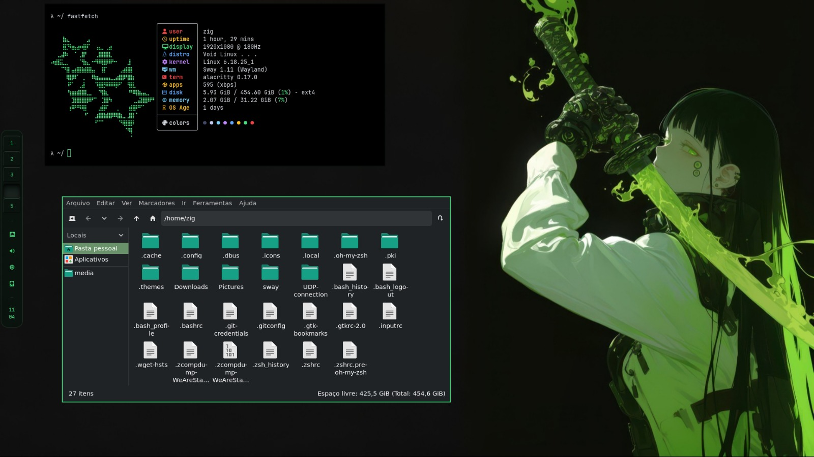

# SWAY DOTS

### (For my Void, Debian, Devuan, Artix - and any other cool distro)

I needed to create some ricing dotfiles because my NixDots (which you can see in my profile) were just for learning how declarable systems and atomic distros work.

So... Here we go.

### Suported Distros -
Every distro that's has Wayland as its main compositor.

> But - how i download it?

Its necessary to install -
 - Sway (WM compositor) - and the tools dependences (pipewire, grim, slurp, fuzzel, udevil - if has runit, openrc init)
 - Waybar (Bar for Wayland)
 - Helix (Text Editor)
 - PcmanFM or another GTK File Explorer (Thunar works very well)
 - Nwg-look - GTK EDITOR(to choose your themes and icons)
 - Alacritty (or kitty, but switch on theme like glacier __ i love this theme wtf)
 - Pavucontrol (onclick audio button)
 

###
Cloning my repo, u need move this folders `alacritty - fastfetch - helix - sway - waybar - fuzzel` on ur `.config` file

The `Picture` folder, move to /home folder, thats wallpapers to sync with sway config
###
